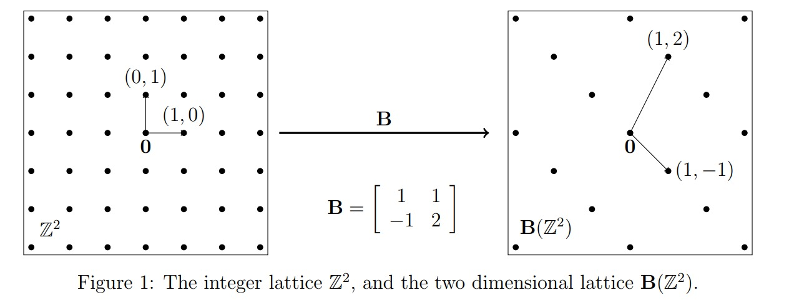
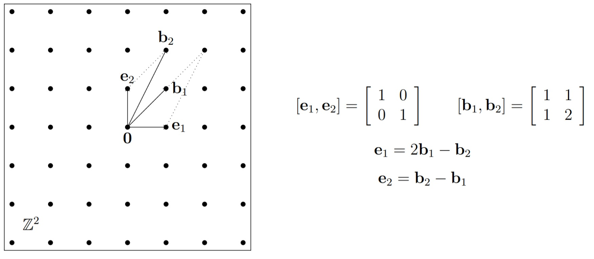
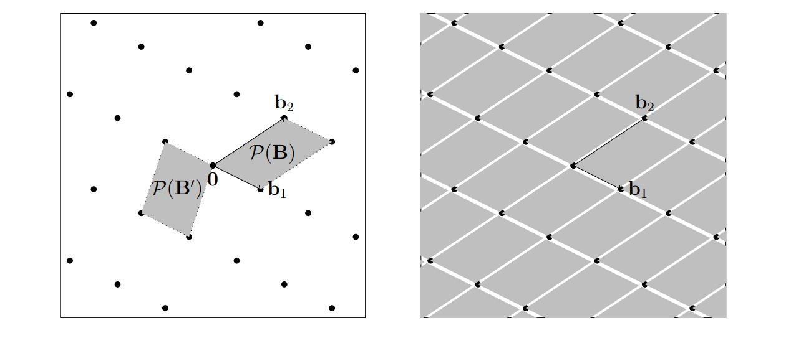
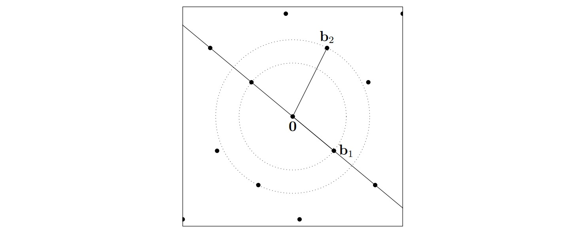
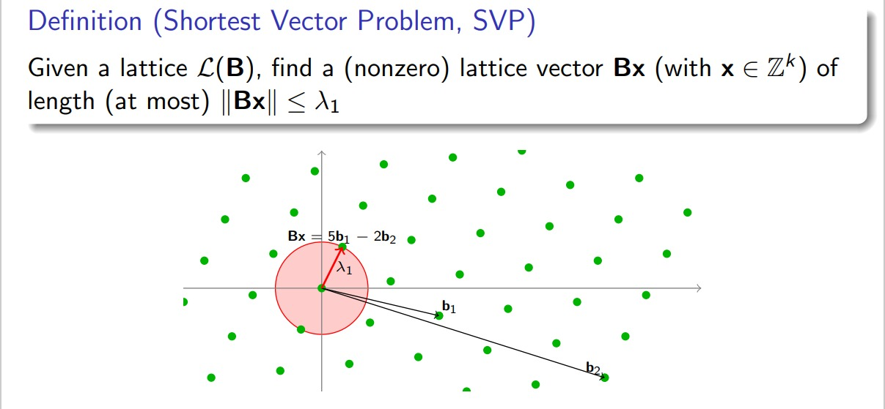
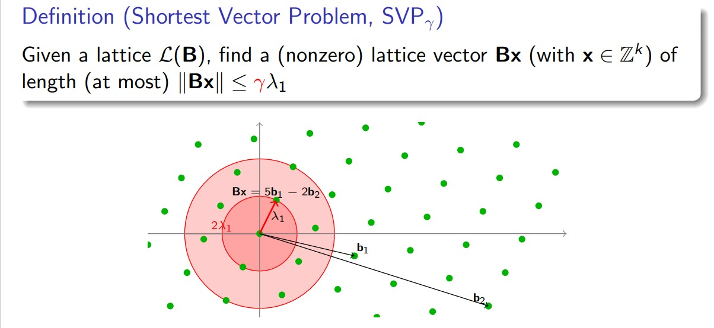
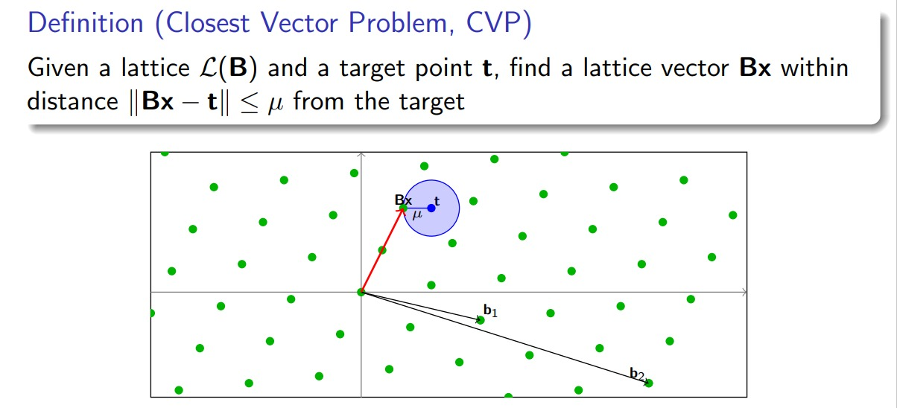
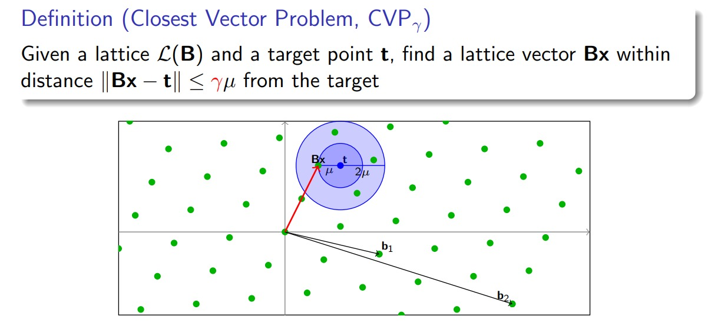

# Lattice学习笔记

<!--more-->
<!-- # Lattice学习笔记 -->

> 咕咕咕，本358团第一鸽子🕊️决定不能再鸽了。
> 不过作为一个 WEB 手，第一篇博客居然写给了 Crypto，这是不是一种广义 NTR？

## Lattice 是什么？

格的定义有很多种，这里我只记了以大一的线代为基础所能理解的两种（~~其他的啥玩意儿啊全是字儿~~

### **定义一**：离散子群

$$
格是R^n上的一个离散子群
$$

众所周知，笔者作为一只非数学系的菜狗是不会群环域的，所以只能简要写一下什么是群（~~对着百度抄就完事了~~

设 $G$ 为一个非空集合，$+$ 是它定义的一个二元运算，如果满足以下条件：

- 封闭性：若 $a,b\in G$，则存在唯一确定的 $c\in G$，使得 $a+b=c$；

- 结合律：$\forall a,b,c \in G，$满足 $\left ( a+b \right ) +c=a+\left ( b+c \right )$；
- 存在单位元：$\exists e\in G，\forall a \in G，a+e=e+a=a$；
- 存在逆元：$\forall a \in G，\exists b \in G，a+b=b+a=e$；

则称 $G$ 对 $+$ 构成一个群

其中，若 $\forall a,b \in G,a+b=b+a$，则称 $G$ 是一个阿贝尔群

那么格就是欧氏空间内点的一种规则排列，其中最简单的格就是就是 $n$ 维空间内的 $\mathbb Z^n$。例如，最简单的二维格就是平面内所有的整数点的集合

### **定义二**：基的整系数组合

格是 $m$ 维欧氏空间 $R^m$ 的 $n(m\ge n)$ 个线性无关向量组 $b_{1},b_{2},...,b_{n}$ 的所有整系数线性组合，即
$$\mathcal L(B)=\left \\{ \sum_{i=1}^{n}x_{i}b_{i}:x_{i}\in \mathbb{Z} ,i=1,2,...,n    \right \\}$$
这一种定义可能更易于我们将其和线性代数联系，其中向量组 $b_{1},b_{2},...,b_{n}$ 称为格的一组基，同一个格可以用不同的基表示

不同的基可以通过线性变换相互转化，这里其实和线代里的子空间的概念很像。同样，对于一组基我们也可以通过施密特正交化、归一化这些方法来使得基成为我们想要的形式

$m$ 称为格的维数，$n$ 称为格的秩，这里和大一学过的线代一样，满足 $m=n$ 的格称为满秩的，一般情况下我们只讨论满秩的格

那么说了那么多，格究竟是什么呢？我们已经知道子空间是一堆线性无关向量张成的空间，那么我们可以把格理解为子空间下的一群有序的离散点集

## Lattice 基本概念

### 行列式（Determinant）

首先我们知道，行列式可以看做是有向面积或体积的概念在一般的欧几里得空间中的推广。那么在格中，行列式 $\det(\mathcal L)$ 的值定义为格的基 $\mathcal P(B)=\left \\{ \sum_{i=1}^{n}x_{i}b_{i},0\le x_{i} < 1 \right \\}$ 的体积

即
$$
\det(\mathcal L)=vol(\mathcal P(B))=\sqrt{B^{T}B}
$$
线性变换不会改变行列式的值。那么显而易见地，对于同一个格的不同基，行列式也是始终不变的。

### 对偶格（Dual lattice）

对偶格与原格在同一个线性空间 $R^{m}$ 中，定义
$$
\mathcal L^{*}=\left \\{ x\in R^{m},\forall v \in \mathcal L,\left \langle x,y \right \rangle \in \mathbb Z \right \\}
$$

### 最短距离（Minimum distance）

对于格 $\mathcal L$，最短距离 $\lambda_{1}$ 是任意两个格点距离的最小值：
$$
\lambda (\mathcal L)=inf\left \\{ \left \| x-y \right \| :x,y \in \mathcal L,x \ne y  \right \\}
$$

当我们把原点作为格中一个点时：


\[ \lambda (\mathcal L)=inf\left \{ \left \| x \right \| :x \in \mathcal L\setminus \left \{ 0 \right \}  \right \} \]


### 逐次最小长度（Successive minima）

接上，那么同理，我们用 $\lambda_{i}$ 表示第$i$短的距离

显然有：
$$
\lambda_{1}\le \lambda_{2}\le \lambda_{3}\le ...\le \lambda_{n}
$$

### 覆盖半径（Covering radius）

对 $n$ 维格, 以格点为球心，$r$ 半径做 $n$ 维球, 能覆盖整个空间的最小 $r$ 称作覆盖半径。

严格地说，若我们定义空间中点到格的距离（Distance function）：

\[ \mu (t,\mathcal L)=\min \limits_{x \in \mathcal L}\left \| t-x \right \| \]

那么覆盖半径（Covering radius）：

\[ \mu (\mathcal L)=\max \limits _{t \in span(\mathcal L)}\mu(t,\mathcal L) \]


## Lattice 计算问题

### 最短向量问题(Shortest Vector Problem, SVP)

给定格 $\mathcal L$，找一个非零格向量 $v$，满足：

\[ \forall u \in \mathcal L\setminus \left \{ 0 \right \} ,\left \| v \right \| \le \left \| u \right \| \]


当给定基的性质比较差时，这个问题是相当难求的。于是我们退而求其次，有了简化版本的$SVP_{\gamma}$：

\[ \forall u \in \mathcal L\setminus \left \{ 0 \right \} ,\left \| v \right \| \le \gamma\left \| u \right \| \]


### 最近向量问题(Closest Vector Problem, CVP)

给定格 $\mathcal L$ 和目标向量 $t \in R^{m}$，找一个非零格向量 $v$，满足：

\[ \forall u \in \mathcal L\setminus \left \{ 0 \right \} ,\left \| v-t \right \| \le \left \| u-t \right \| \]


同样，$CVP$ 也有它的简化版本 $CVP_{\gamma}$：

\[ \forall u \in \mathcal L\setminus \left \{ 0 \right \} ,\left \| v-t \right \| \le \gamma \left \| u-t \right \| \]


$SVP,CVP$ 都已经被证明是 $NP-Hard$ 问题，硬上是肯定不行了，那么我们就需要一些近似算法

> Waiting for update

